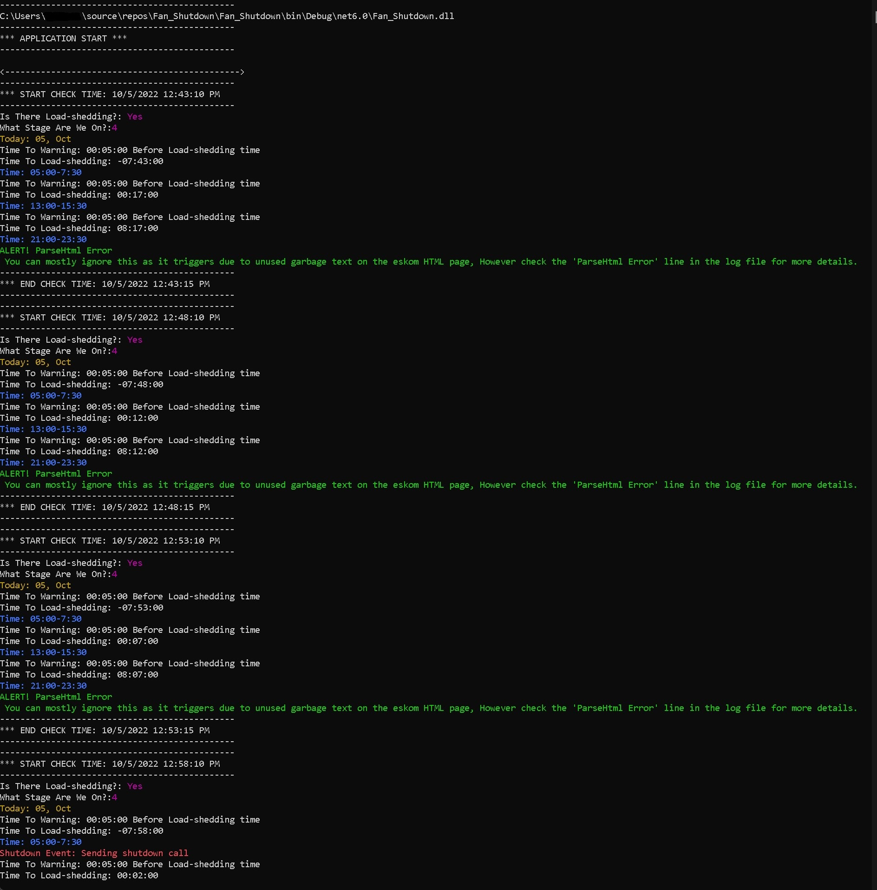

# Practical Usage Of Load Shedding API

In this repository you can find the Fan_shutdown example app which is a practicaly example of how to use the loadshedding api to shutdown a fan 5 mins before the loadshedding time.

### Description:

The app works by first checking if there is load-shedding via the `GetStatus` endpoint `https://loadshedding.eskom.co.za/LoadShedding/GetStatus` and also then displays what stage of load-shedding is currently plaguing us.

After this the app calls `GetScheduleM` endpoint `http://loadshedding.eskom.co.za/LoadShedding/GetScheduleM/<suburb_id>/<stage>/<province_id>/<municipality_total>` and receives an HTML page with the schedule info. 

Now the app retuned the HTML text only as a string and then the app runs a loop to process this information. 

Finally after a few checks in the loop the current days load-shedding times are returned. also within the loop it is possible to compare times and trigger a shutdown 5 minutes before load-shedding like in my example.

The loop also ignores negative times because they are pas load-shedding times.

Please note that the app uses the computer time where the app is running... so if this is wrong the the results can be wrong. 

Also if you check the API `GetScheduleM` endpoint in large time frames it's possible that the app will fail to send you an alert in time because the time fram overshadows the load-shedding start time. 

An easy fix is to start the app on the hour such as at **9:00am** and then set your **`toWarning`** time to a few minutes like 30 minutes, 10 minutes or 5 minutes.

---

Example of the loop with a shutdown call represented by `Console.WriteLine($"Shutdown Event: Sending shutdown call");`

I set the check time to every 5 minutes and when the loop returned a time within my 5 minute set value the `Shutdown Event: Sending shutdown call` was triggered.

---

Example of `GetScheduleM` HTML structure

---

### ToDo
- Make `<suburb_id>/<stage>/<province_id>/<municipality_total>` variables easy to add
- Improve loop
- Make .NetFramework version
